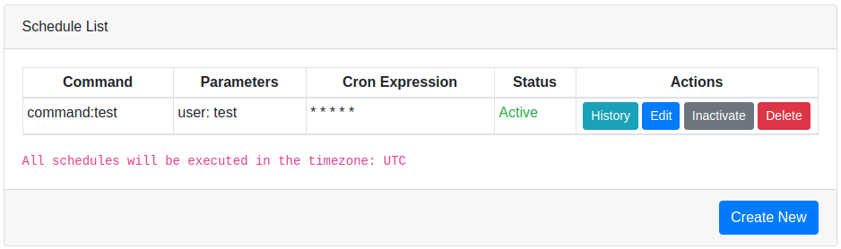
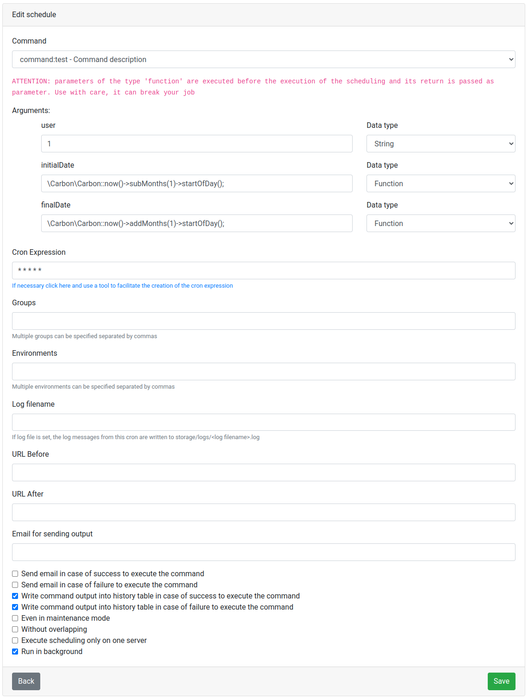
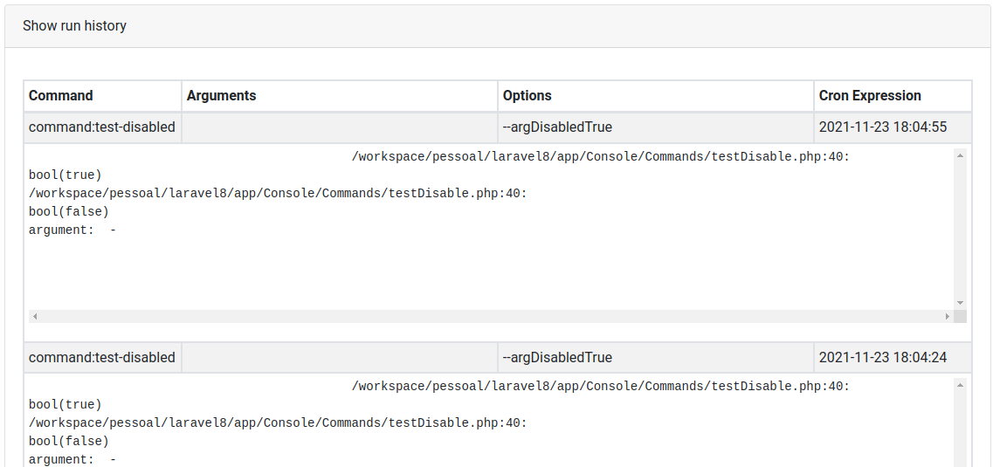

# Documentation

This librarian creates a route(default: /schedule) in your application where it is possible to manage which 
schedules will be executed at any given moment, these schedules are recorded in the database and can be changed, 
activated, inactivated or deleted via the interface without the need for a new application deployment.







## Installation

1. Run ```composer require robersonfaria/laravel-database-schedule```
2. Run ```php artisan migrate```

### Environment variables

You can set the following environment variables to configure schedules:

* SCHEDULE_TIMEZONE : The default is the same configured for the application, but if you need the schedules to run in a different timezone, it is possible to configure it with this variable
* SCHEDULE_CACHE_DRIVER : The default is `file`
* SCHEDULE_CACHE_ENABLE : The default is disabled when `APP_DEBUG=true` and enabled when `APP_DEBUG=false`

### Configurations

There are several library configuration options, to change the settings you can get the configuration file for your project
```
php artisan vendor:publish --provider="RobersonFaria\DatabaseSchedule\DatabaseSchedulingServiceProvider" --tag="config"
```

### Dashboard Authorization

Dashboard Authorization exposes a dashboard at `/schedule` URI.
This route is protected by the `viewDatabaseSchedule` gate controls access.
You are free to modify this gate as needed to restrict access to your Database Schedule Dashboard

```php
protected function gate()
{
    Gate::define('viewDatabaseSchedule', function ($user) {
        return in_array($user->email, [
            'roberson.faria@gmail.com',
        ]);
    });
}
```

## Credits

* That library was inspired by the library [therezor/laravel-database-schedule](https://github.com/therezor/laravel-database-schedule)